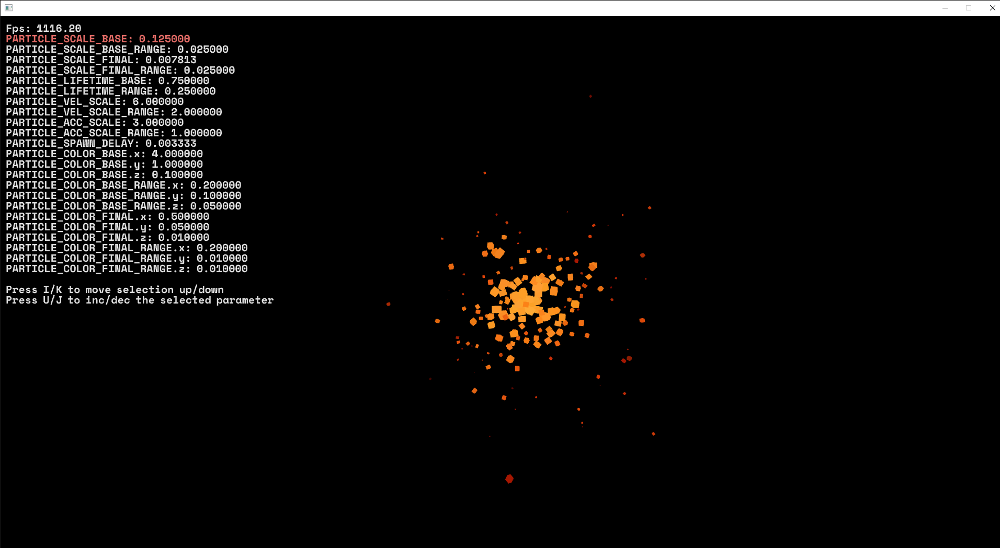

# ECS Particles
This example shows how you might create a particle system using the ECS in Quark.

The code is heavily commented to explain what everything does.

## Controls
- **WASD** - move around
- **SPACE/LEFT CONTROL** - move up/down
- **MOUSE** - look around
- **I/K** - move the selection up/down
- **U/J** - increase/decrease the selected value

## Build
A build is available in [bin/ecs_particles/](../../bin/ecs_particles/).

## Output
You can configure the parameters of the particle emitter, by default it looks like this:

