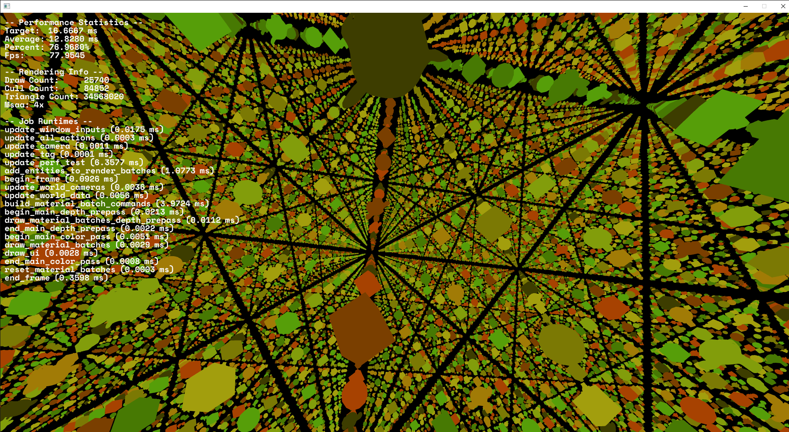

# Performance Test
This example tests the rendering performance of Quark. It works by spawning a 48x48x48 cube of entities with random models then spins around the camera..

On my machine with a GTX 1070 and Ryzen 7 1700x, I can get around 70 to 80 FPS in the benchmark.

For more details about what makes the renderer fast, check out the page on the wiki located [here](https://github.com/WindowsVista42/Quark-Engine/wiki/GPU-Driven-Rendering). In short, it's a forward renderer that batches everything into one draw call using indirect rendering, and reuses the commands for the depth pre-pass and main color pass.

The code is heavily commented to explain what everything does.

## Controls
- **ESCAPE** - close the program

## Build
A build is available in [bin/performance_test/](../../bin/performance_test/).

## Output
Running the program should show something like this:

