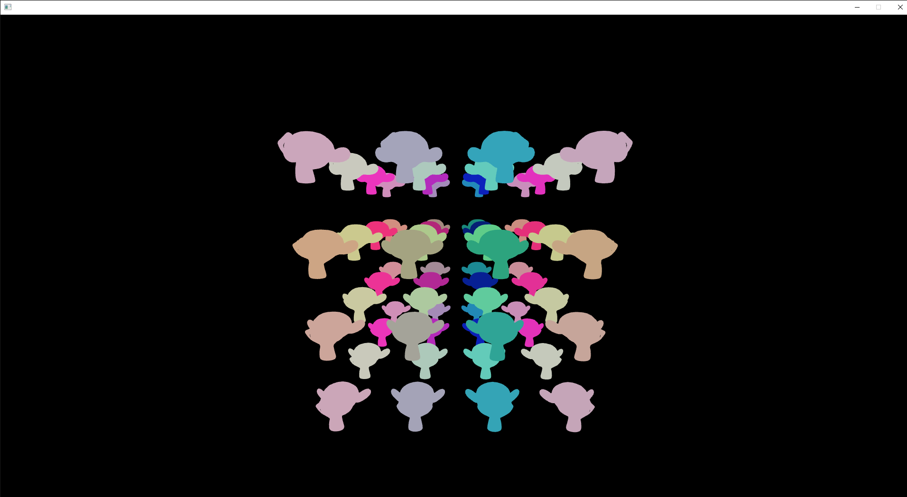

# Rendering Basics
This example shows how to render things in quark. It shows how to add materials to entities, how to update those materials, and how to push renderable entities into the draw batches.

The code is heavily commented to explain what everything does.

## Controls
- **WASD** - move around
- **SPACE/LEFT CONTROL** - move up/down
- **MOUSE** - look around
- **ESCAPE** - close the program

## Build
A build is available in [bin/rendering_basics/](../../bin/rendering_basics/).

## Output
Running the example should look something like this:

