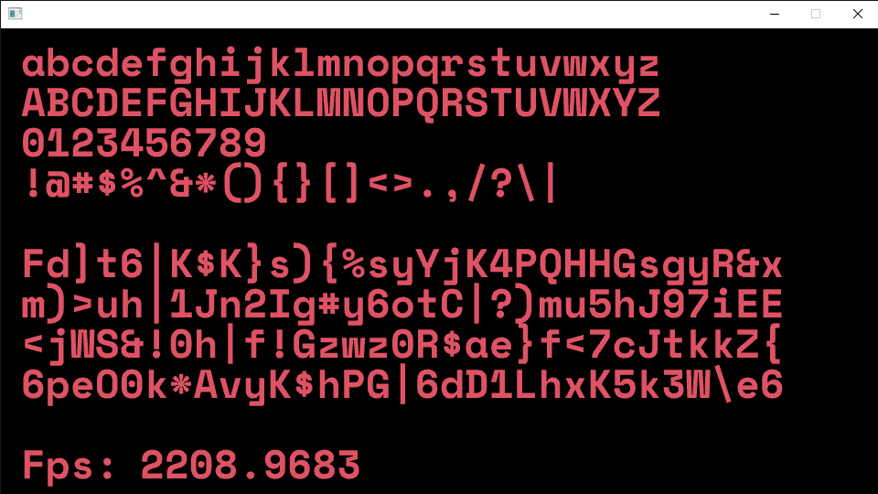

# Text Rendering
This example shows how to render and format text in quark.

The code is heavily commented to explain what everything does.

## Controls
- **ESCAPE** - close the program

## Build
A build is available in [bin/text_rendering/](../../bin/text_rendering/).

## Output
Running the example should look something like this:

